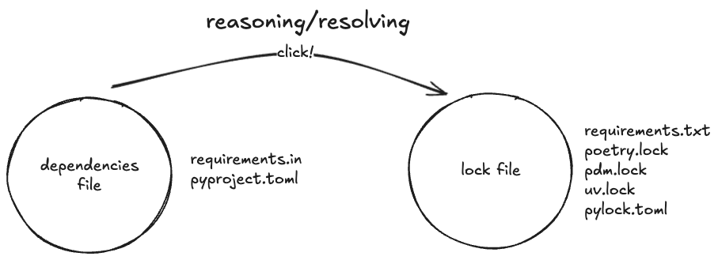

## `venv`s  and lockfiles

how python is improving <span class="highlight">reproducibility</span>

---
## Why

You shouldn't <span class="highlight">reinvent the wheel</span> every time

You could work on <span class="highlight">more than one project</span> at a time

You might want to <span class="highlight">share</span> what you did with others
<div class="logos">
    
    
    
    
    
</div>
Note:
More projects at a time
- Conflicting package versions
- Import boundaries

Different platforms
- On different operating systems (MacOS, Linux)
- On different architectures (PPC, ARM, x86_32, x86_64, RISC, ...)

---
## Advantages

<div class="side-by-side">
    <ul>
        <li><a href="https://www.youtube.com/watch?v=MMVVboVL5eU&t=407s">Simplicity</a></li>
        <li>Security</li>
        <li>Reproducibility</li>
    </ul>
    <div class="deck">
        
        
        
    </div>
</div>

Note:
<code>¯\_(ツ)_/¯</code>
Simplicity: python packaging is hard. `venv`s and lockfiles simplify setup hassle when learning a new technology; just think about python versions, operating systems.
Security: what if somebody hijacks a version of a package among your dependencies that you didn't even notice?

---


---

## History

<ul class="history">
    <li>virtualenv (2007)</li>
    <li>pip (2009)</li>
    <li>tox (2010)</li>
    <li>pip-tools and venv (PEP405) (2011)</li>
    <li>conda (2012)</li>
    <li>pyproject.toml (PEP528) (2016 implemented in pip in 2018)</li>
    <li>pipenv (2017)</li>
    <li>poetry, nox, pipx (2018)</li>
    <li>pdm (2020)</li>
    <li>hatch (2022)</li>
    <li>uv (2024)</li>
    <li>lockfile - PEP-751 (2025)</li>
</ul>

Note:
pdm-project.org, not just the build backend

```sh
python -m virtualenv .venv
```

```sh
pip install package (imperative)
pip freeze > requirements.txt
pip install -r requirements.txt (declarative)
```

```sh
pip compile
pip sync
```
---
## _C'était mieux avant_

<span style="font-size: 24px;"><i>No, not really.</i></span>


(https://xkcd.com/1987/)

---
## 2012 - pip-tools and venv (python3.3)
imperative vs declarative

```sh
-- imperative
python3.3 -m venv .venv
.venv/bin/activate
pip install dependency

-- declarative
pip compile requirements.in > requirements.txt
pip sync requirements.txt
```

---
## How does a virtual environment look like?

<div class="side-by-side">
<ul>
    <li>a venv folder <span class="highlight">in the project folder</span></li>
    <li>a link to the python interpreter binary</li>
    <li>the project dependencies</li>
</ul>

</div>

Note:
- reproducible environments: given a description of the venv, we can share the project with others
- safe experimentation - different python versions, upgrade your dependencies
- no root access - you odn't need write access to system folders
- dependencies isolation - the dependencies of this project do not interphere with other projects

---
## Better, but still ..

- which python version should I use? 🐍
- manual operations 😮‍💨
- os/platform? 😱
- variety of formats to define project and dependencies 🗃️
- what about transitive dependencies? ♻️
- what about security, supply-chain attacks? 🔒
- where to store the virtual environment? 💾

Note:
manual operations: keep in mind your virtual environment and its dependencies then freeze it
os/platform: operating system (binaries included with libraries should have compiled ad hoc for every OS)

---
## pyproject.toml (2016)

```toml
[project]
name = "rt-voice-assistant"
version = "0.1.0"
description = "Hello world!"
readme = "README.md"
requires-python = ">=3.12"
dependencies = [
    "requests>=2.31.0",
]

[dependency-groups]
dev = [
    "pytest>=8.4.1",
    "ruff>=0.12.11",
]
```

---
## Dependencies (format)

- item
- extras
- version requirements
- environment markers

```toml
example[extra] > 1.2.3; python_version < 3.14
```

---

## Lockfile (2025)



- Pin all the versions, including the transitive ones
- Include the details about the source of the package, including its digital signature
- Version this file!

---

## how do you manage virtual envs in 2025?

```sh
uv init --python 3.14
uv add dependency # only when the dependency is added

uv sync # determine your dependencies and restore them
uv run main.py # use the venv in this folder to run main.py
```

<a href="https://emily.space/posts/251023-uv">
    
</a>

---

## distribute single scripts

```sh
uv init --script main.py
uv add --script main.py "requests<3"
ur run main.py
```

```py
# /// script
# dependencies = [
#   "requests<3",
# ]
# ///
```

---

## Is this enough for security?

- use a private package repository
- on CI environments, make sure that the dependencies manager does not try to upgrade (eg. `uv sync --frozen`)
- use an automated tool to scan new dependencies/new versions (bandit, snyk)
- zero secrets in code

Note:
`uv` (or any package manager) without command line options is a good starting point; if you work in a security-first environment, you should read the manual carefully.

- uv by default tries to update your dependencies, keeping stable the pyproject.toml dependencies (first level dependencies only)
- consider using a private registry (nexus, artifactory, azure devops, github packages) containing only the safe versions of your dependencies.

- typosquatting
- post-install scripts
- dependencies confusion

---
# Take-aways
- virtual environments, lockfiles seem easy, but they are not
- python has standardized late their formats, at last we have a consensus!
- tools like `uv` simplify greatly the dependencies management
  (transparently produces a lockfile, ensuring python-level reproducibility)
- if you don't like uv for any reason, pick another dependencies manager!

---
# Thank you!
<div class="side-by-side">
    <div>
        <p>
        Any questions? Get in touch!
        <p>
        <a href="mailto:ivo@nilleb.co">ivo@nilleb.co</a>
    </div>
<p>
You liked this presentation?
Star the repo on GitHub!
<br>

</p>
</div>
